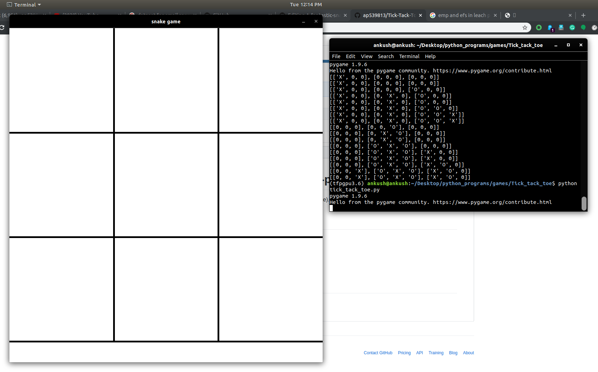
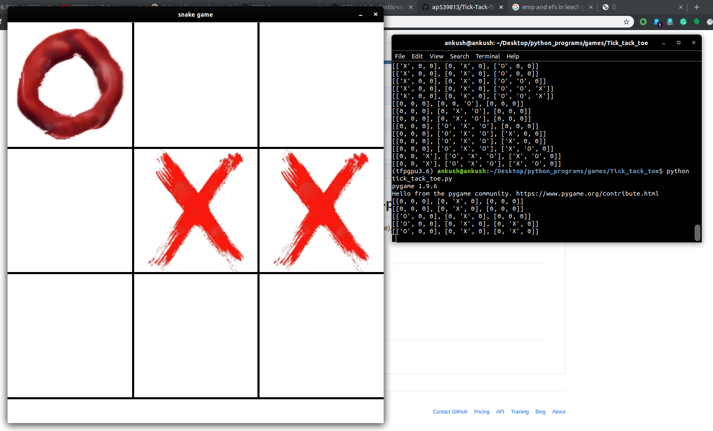
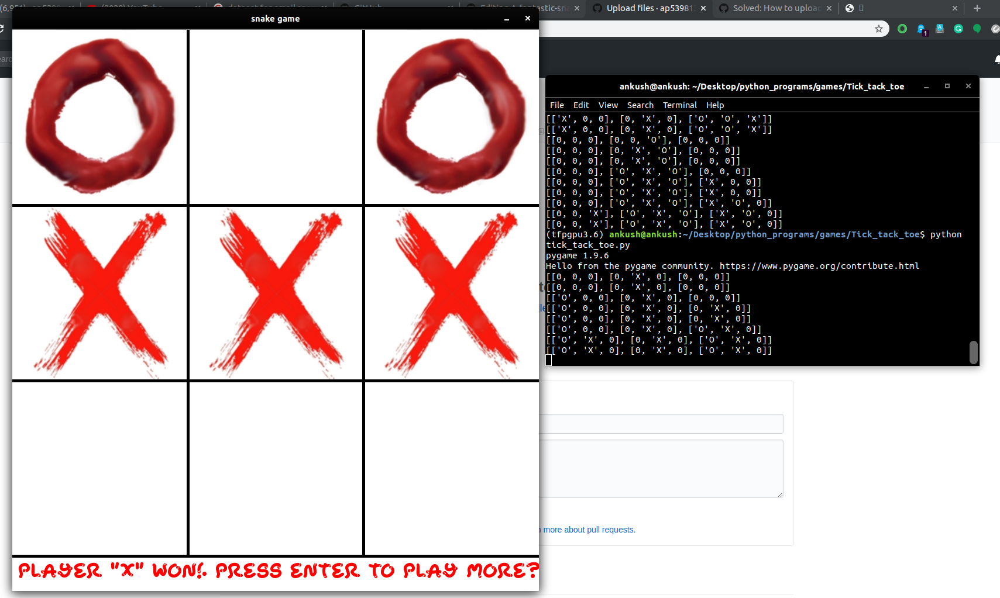

# Tick-Tack-Toe-using-python-and-pygame
A GUI implementation of the Tick Tack Toe game using python (pygame).

# Requirements
- Python 3.x
- pygame

# Screenshots related to the project are shown below:

# 1.6 RESULTS:

* A complete gameplay in shown in this video : 

# NOTE
Please do not delete any of the audio or text file of this repository.
